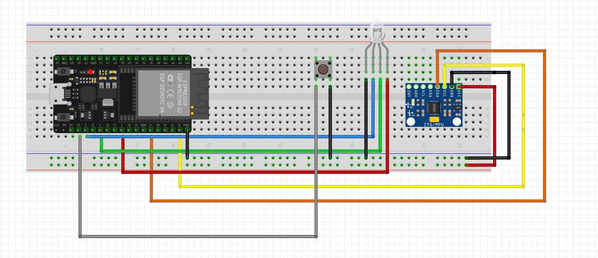
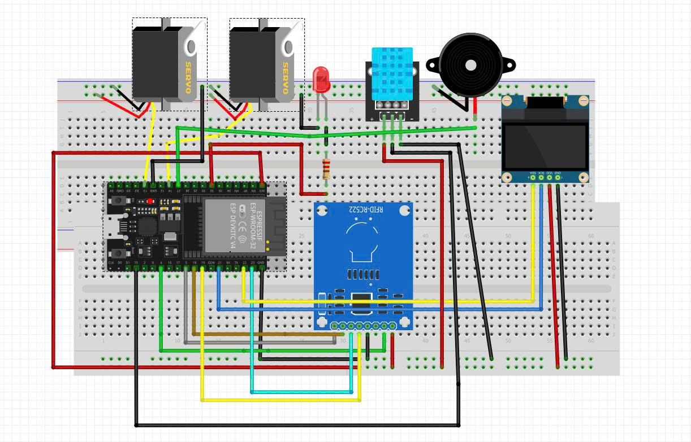
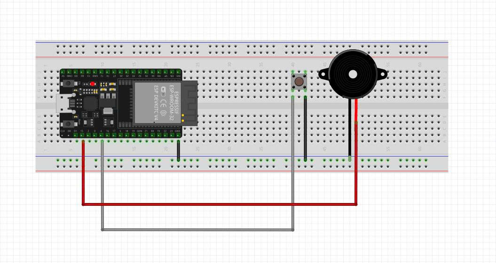
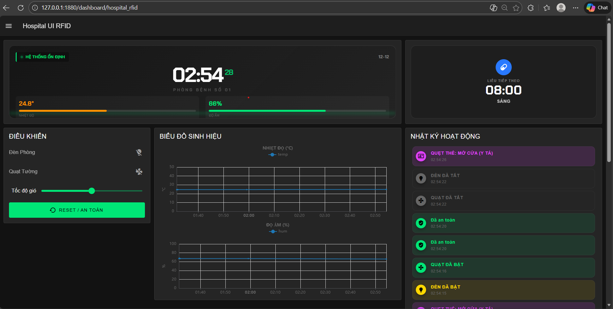
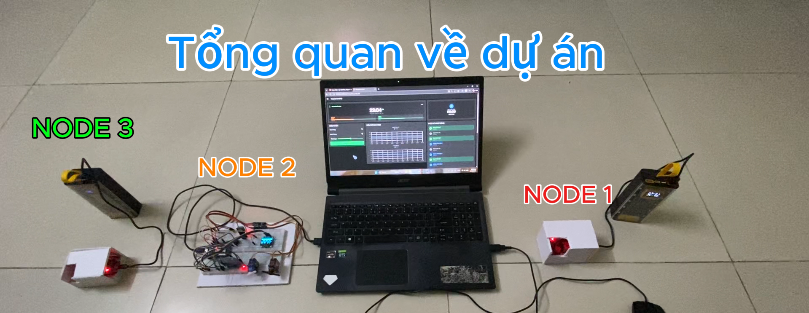

# 🪄 Medical Wand: Mạng Lưới Cảm Biến Mesh (ESP-MESH / ESP-NOW)
> **Hệ thống Y tế Thông minh: Giám sát Từ xa & Điều khiển Bằng Cử chỉ**

---

## 1. Đặt Vấn Đề & Giới Thiệu Dự Án

**MedicalWand** là giải pháp IoT sử dụng ESP32, được thiết kế để nâng cao chất lượng chăm sóc bệnh nhân tại phòng bệnh. Dự án giải quyết các vấn đề cấp thiết như: thiếu khả năng tự chủ của bệnh nhân, phản ứng chậm trễ của nhân viên y tế trước các sự cố ngã/SOS, và nhu cầu giám sát môi trường liên tục.

Hệ thống hoạt động trên kiến trúc mạng lưới lai (Hybrid Network), tận dụng tốc độ cao của **ESP-NOW** cho giao tiếp cục bộ và sự ổn định của **MQTT/SSL** cho kết nối Cloud.

## 2. Kiến Trúc Mạng Lưới & Sơ Đồ Khối

Kiến trúc của MedicalWand được xây dựng trên mô hình **Star Network** với Node 2 (Gateway) làm trung tâm:
* **Node 1 (MedicalWand):** Thiết bị đeo tay, chịu trách nhiệm phát hiện ngã, gửi SOS, và điều khiển bằng cử chỉ.
* **Node 2 (Room Hub):** Gateway nhận dữ liệu từ các Node khác và cảm biến phòng, điều khiển thiết bị điện, và truyền dữ liệu lên Node-RED Dashboard.
* **Node 3 (Nurse Key):** Remote cầm tay để y tá nhận cảnh báo và tiếp nhận/xác nhận xử lý sự cố từ xa rồi đến hỗ trợ.

## 3. Phần Cứng & Sơ Đồ Chân (Pinout)

Hệ thống bao gồm 3 Node ESP32, MPU6050, DHT11, RFID RC522, OLED SSD1306, Servo Motors, Nút bấm và các Actuators.

### 3.1. Sơ đồ chân Node 1 – Thiết bị đeo tay (Bệnh nhân)

| Thiết bị | Chân thiết bị | Chân ESP32 (Node 1) |
| :--- | :--- | :--- |
| **MPU6050** | VCC | 3.3V |
| | GND | GND |
| | SCL | GPIO 22 |
| | SDA | GPIO 21 |
| **Nút SOS** | 1 chân | GPIO 15 |
| | 1 chân | GND |
| **LED RGB** | Red | GPIO 5 |
| | Green | GPIO 4 |
| | Blue | GPIO 2 |
| | Common (Âm chung) | GND |

### 3.2. Sơ đồ chân Node 2 – Room Hub (Gateway)

| Thiết bị | Chân thiết bị | Chân ESP32 (Node 2) |
| :--- | :--- | :--- |
| **OLED SSD1306** | SCL | GPIO 22 |
| | SDA | GPIO 21 |
| **DHT11** | DATA | GPIO 15 |
| **RFID RC522** | SDA (SS) | GPIO 5 |
| | RST | GPIO 4 |
| | SCK | GPIO 18 |
| | MOSI | GPIO 23 |
| | MISO | GPIO 19 |
| **Servo Cửa** | Signal | GPIO 13 |
| **Servo Quạt** | Signal | GPIO 14 |
| **Buzzer (Còi)** | + | GPIO 27 |
| **LED (Đèn)** | + | GPIO 32 |

### 3.3. Sơ đồ chân Node 3 – Nurse Key (Remote)

| Thiết bị | Chân thiết bị | Chân ESP32 (Node 3) |
| :--- | :--- | :--- |
| **Nút Bấm** | 1 chân | GPIO 4 |
| | 1 chân | GND |
| **Buzzer** | + | GPIO 15 |
| **LED Báo Hiệu (Red)** | + | GPIO 19 |

---

## 4. Tính Năng Nổi Bật

Medical Wand cung cấp các tính năng cốt lõi sau:

* **Phát hiện và cảnh báo khẩn cấp:** Tự động phát hiện té ngã (qua MPU6050) và nút SOS cho phép bệnh nhân gọi cấp cứu ngay lập tức.
* **Điều khiển bằng cử chỉ (Wand Control):** Bệnh nhân có thể điều khiển Đèn và Quạt trong phòng chỉ bằng cách nghiêng thiết bị đeo tay, tăng cường tính tự chủ.
* **Đồng bộ trạng thái (2-Way Sync):** Trạng thái thiết bị được đồng bộ hoàn hảo giữa nút bấm vật lý, cử chỉ và giao diện Web.
* **Giám sát môi trường & Y tế:**
    * Màn hình OLED tại phòng hiển thị trạng thái, giờ giấc, nhiệt độ/độ ẩm.
    * Node-RED Dashboard vẽ biểu đồ thời gian thực của Nhiệt độ/Độ ẩm.
    * Hệ thống nhắc nhở uống thuốc tự động.
* **Phản hồi nhanh:** Y tá có thể sử dụng Remote (Node 3) để tắt còi và xác nhận xử lý sự cố.
* **Gửi Email:** Tự động gửi Email cảnh báo (kèm thông số nhiệt độ/độ ẩm tại thời điểm SOS) với tính năng chống Spam.

---

## 5. Cài Đặt & Cấu Hình Phần Mềm

Yêu cầu phần mềm bao gồm Arduino IDE (với Board ESP32), các thư viện MPU6050, DHT, ESP-NOW, PubSubClient, và Node-RED (với Dashboard 2.0). Cần cấu hình:
1.  Thông tin **WIFI\_SSID** và **MQTT Broker** trong file `Config.h` của từng Node.
2.  Các địa chỉ **MAC** của các Node để thiết lập ESP-NOW Peer.
3.  Cấu hình **Email SMTP** (Mật khẩu ứng dụng Gmail) trong Node-RED.

---

## 6. Kết Quả Dự Án (Ảnh & Video)

### 📸 Giao Diện Node-RED Dashboard

Hệ thống sử dụng **Node-RED Dashboard 2.0** – phiên bản hoàn toàn mới được FlowFuse phát hành chính thức năm 2024, thay thế hoàn toàn Dashboard cũ (node-red-dashboard 3.x).

**Ưu điểm vượt trội so với phiên bản cũ:**
- Giao diện hiện đại theo phong cách **Glassmorphism + Neumorphism**, hỗ trợ Dark/Light mode tự động.
- Hỗ trợ **responsive 100%** (đẹp trên điện thoại, tablet, PC, TV phòng y tá).
- Tốc độ render cực nhanh nhờ sử dụng **Vue 3 + Vite**.
- Widget mới mạnh mẽ: Chart thời gian thực (dùng Chart.js), Gauge neon, Notification toast, Table phân trang, Button có icon + hiệu ứng hover.
- Theme tùy chỉnh dễ dàng bằng JSON (mình đã tạo theme kính mờ trong suốt rất đẹp).
- Hỗ trợ layout Grid CSS hiện đại, kéo thả thoải mái không cần code HTML.
- Tích hợp sẵn PWA → có thể cài đặt lên màn hình chính điện thoại như app thật.

Kết quả: Chỉ với Node-RED thuần, mình có một dashboard trông giống ứng dụng thương mại trị giá hàng nghìn USD, hoàn toàn miễn phí và chạy mượt trên Raspberry Pi hoặc PC bệnh viện 24/7.

Link tham khảo chính thức:  
https://dashboard.flowfuse.com

*Giao diện Giám sát chính với thiết kế Glassmorphism và Đồng hồ Neon*

### 🛠️ Sơ đồ lắp đặt thực tế

*Mô hình phần cứng hoàn thiện*

### 🎥 Video Demo
[Xem Video Demo hoạt động MedicalWand tại đây](https://youtu.be/p2y1Bo7qkoU)

---

## 7. Kết Luận & Hướng Phát Triển

Dự án đã hoàn thành và hoạt động ổn định vượt mong đợi, tạo nên một hệ thống chăm sóc bệnh nhân thông minh thực sự có thể triển khai thực tế với chi phí thấp.  
Hệ thống không chỉ đáp ứng đầy đủ các yêu cầu đề ra mà còn duy trì hoạt động liên tục ngay cả khi mất kết nối Internet — điều mà hầu hết các giải pháp IoT hiện nay chưa làm được.

**Thành tựu nổi bật:**
- Phát hiện ngã và gửi cảnh báo khẩn cấp với độ trễ dưới 100 ms (kể cả offline).
- Điều khiển thiết bị bằng cử chỉ tay chính xác, trực quan cho bệnh nhân nằm liệt.
- Phản hồi tức thì hai chiều giữa bệnh nhân – y tá – dashboard.
- Giao diện Node-RED Dashboard hiện đại (Glassmorphism + Dark Mode) đẹp ngang ứng dụng thương mại.
- Qua kiểm tra đã biết được giới hạn là 10m khi không có vật chắn.

**Hướng phát triển tương lai:**
- Nhúng mô hình TinyML (TensorFlow Lite for Microcontrollers ) lên ESP32 để nhận diện ngã và cử chỉ chính xác hơn, giảm báo động giả.
- Thêm cảm biến nhịp tim & SpO2 (MAX30102), theo dõi sức khỏe liên tục.
- Phát triển ứng dụng di động Flutter/React Native cho y tá và người nhà nhận thông báo đẩy real-time.
- Tích hợp camera AI (ESP32-CAM + Edge Impulse) để xác nhận trực quan sự cố ngã.
- Mở rộng thành hệ thống nhiều phòng bệnh với Mesh ESP-NOW + MQTT fleet management.

**Project by: [Dương Bá Quyết]**  
Một dự án nhỏ nhưng mang lại giá trị thực tế rất lớn cho cộng đồng chăm sóc sức khỏe.

Cảm ơn thầy cô, bạn bè và gia đình đã đồng hành!
